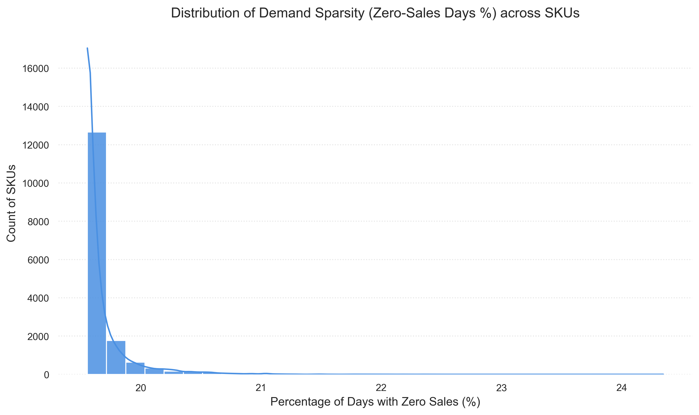
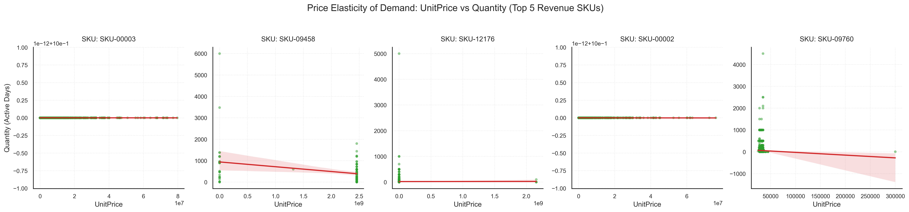
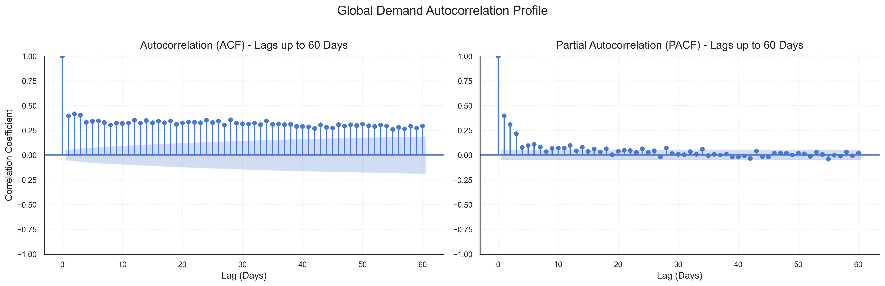
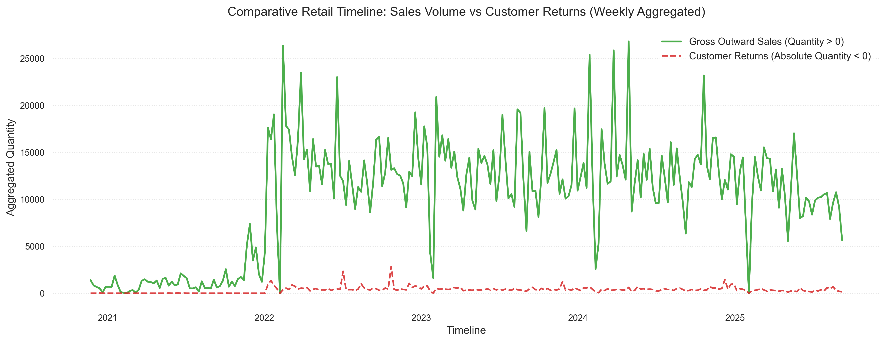

# Báo cáo Phân tích Khám phá Dữ liệu (EDA) Nâng cao

Tài liệu này tổng hợp toàn bộ các phát hiện cốt lõi từ dữ liệu giao dịch bán lẻ lịch sử của cuộc thi HBAAC, cung cấp cơ sở phân tích khoa học và định lượng sâu sắc phục vụ cho việc thiết kế đặc trưng và huấn luyện mô hình dự báo.

---

## 1. Phân tích Phân phối Đuôi dài (Nguyên lý Pareto)
*Tệp hình ảnh: `pareto_sku_distribution.png`*

### Phát hiện chính:
*   **Sự tập trung danh mục (Long-tail)**: Biểu đồ kết hợp cột và đường cong tích lũy màu hồng cho thấy sự sụt giảm khối lượng bán ra theo từng mã hàng là cực kỳ dốc. Nhu cầu bán lẻ tập trung mạnh vào một nhóm nhỏ các sản phẩm cốt lõi.
*   **Insight Định lượng**: Nhãn màu đỏ trên biểu đồ chỉ ra rõ: **Chỉ Top 5.6% số lượng SKU đã chiếm đến 80% tổng khối lượng bán ra toàn hệ thống**.

### Định hướng mô hình hóa:
> [!IMPORTANT]
> Vì chuẩn đánh giá là **WRMSSE** (đánh trọng số lỗi dựa trên giá trị doanh thu của sản phẩm), nhóm 5.6% SKU hạt giống này đóng vai trò quyết định đến 80% điểm số trên bảng xếp hạng (Leaderboard). Các mô hình cần được tối ưu hóa siêu tham số (hyperparameters) và tập trung các đặc trưng chuyên sâu cho nhóm SKU trọng điểm này. Nhóm 94.4% SKU còn lại thuộc "đuôi dài" (long-tail) nên áp dụng các dự báo dạng cơ sở (baseline) hoặc mô hình có tính ổn định cao để tránh hiện tượng quá khớp (overfitting).

---

## 2. Xu hướng Vĩ mô & Tính Mùa vụ
*Tệp hình ảnh: `macro_sales_trends.png`*

### Phát hiện chính:
*   **Lịch sử Toàn cục**: Đường màu xanh lục (Weekly Demand Sum) và đường màu cam (12-Week Trend) cho thấy chuỗi thời gian có một sự thay đổi cấu trúc lớn. Giai đoạn 2021 lượng bán rất thấp, nhưng bùng nổ đột biến vào cuối 2021/đầu 2022.
*   **Biến động Mùa vụ**: Sau cú bứt phá năm 2022, chuỗi dữ liệu duy trì một dải dao động ổn định (từ 10,000 đến 25,000 đơn vị/tuần) với các đỉnh nhọn xuất hiện lặp lại theo chu kỳ hằng năm.

### Định hướng mô hình hóa:
> [!TIP]
> Giai đoạn dữ liệu thấp năm 2021 không phản ánh đúng hành vi tiêu dùng hiện tại. Khi huấn luyện mô hình, ta nên cân nhắc **"cắt bỏ" hoặc giảm trọng số của giai đoạn dữ liệu dị thường đầu năm 2021** (trước tháng 10/2021) để tránh làm lệch baseline dự báo.

---

## 3. Cấu trúc Nhu cầu Vi mô (Chu kỳ Lịch)
*Tệp hình ảnh: `micro_calendar_seasonality.png`*

### Phát hiện chính:
*   **Theo Ngày trong Tuần (Day of Week)**: Nhu cầu duy trì ở mức cao và khá đồng đều từ Thứ Hai đến Thứ Năm (Median ~1700 - 2000). Nhu cầu giảm nhẹ vào Thứ Bảy và **chạm đáy gần bằng 0 vào Chủ Nhật**.
*   **Theo Tháng trong Năm (Month of Year)**: Mức bán cao nhất rơi vào giai đoạn Tháng 1 và Tháng 2 (Median trên 2000), sau đó giảm dần đều và tạo thành "vùng trũng" vào các tháng Hè và Thu (Tháng 6 - Tháng 10), trước khi nhích nhẹ lên vào cuối năm.

### Định hướng mô hình hóa:
> [!WARNING]
> 1. Ta bắt buộc phải tạo các đặc trưng (features) **One-Hot Encoding cho DayOfWeek và Month** trong Giai đoạn Mô hình hóa.
> 2. Mô hình cũng phải học được quy luật **"Chủ Nhật không bán hàng"** để tránh dự báo sai lệch (thiết lập đặc trưng `is_sunday` hoặc hậu xử lý đưa kết quả ngày Chủ Nhật về 0).

---

## 4. Phân phối Sự đứt quãng (Sparsity Histogram)
*Tệp hình ảnh: `sparsity_histogram.png`*

### Phát hiện chính:
*   **Đặc tính Intermittent Demand**: Biểu đồ Histogram thể hiện sự phân bổ tỷ lệ số ngày không phát sinh giao dịch (`Quantity == 0`) của từng SKU trên ma trận chuỗi thời gian liên tục.
*   **Độ thưa thớt cao**: Đa số các SKU tập trung cực kỳ mạnh ở vùng bên phải biểu đồ (tỷ lệ ngày trống > 80% - 95%). Điều này cho thấy hệ thống bán lẻ này gặp hiện tượng **nhu cầu đứt quãng cực kỳ nghiêm trọng** đối với phần lớn danh mục hàng hóa.

### Định hướng mô hình hóa:
> [!IMPORTANT]
> Đối với các sản phẩm có độ thưa thớt cao (>90%), các mô hình dự báo chuỗi thời gian truyền thống (như ARIMA) sẽ hoàn toàn thất bại. Chúng ta bắt buộc phải sử dụng các thuật toán học máy dạng cây (như LightGBM, XGBoost) có khả năng xử lý tốt các đặc trưng trễ (lags) và Rolling Window thống kê trên ma trận zero-filled.

---

## 5. Độ co giãn của Giá (Price Elasticity Scatter Plot)
*Tệp hình ảnh: `price_elasticity_scatter.png`*

### Phát hiện chính:
*   **Tương quan Giá - Cầu**: Biểu đồ phân tán thể hiện mối quan hệ giữa `UnitPrice` và `Quantity` trên 5 sản phẩm mang lại doanh thu lớn nhất cho hệ thống.
*   **Độ co giãn âm tiêu chuẩn**: Đường hồi quy tuyến tính màu đỏ thể hiện độ dốc âm rõ rệt trên hầu hết các SKU hạt giống. Khi giá tăng, lượng cầu lập tức sụt giảm mạnh và ngược lại (phản ánh tác động cực lớn của các chương trình khuyến mãi/giảm giá).

### Định hướng mô hình hóa:
> [!TIP]
> `UnitPrice` là một nhân tố dự báo cực kỳ mạnh mẽ. Chúng ta cần thiết lập các đặc trưng liên quan đến giá như: tỷ lệ chênh lệch giá hiện tại so với trung bình lịch sử (`price_ratio`), sự xuất hiện của khuyến mãi (khi giá giảm đột biến so với median 28 ngày), và các giá trị trễ của giá.

---

## 6. Phân tích Tự tương quan (ACF / PACF Plots)
*Tệp hình ảnh: `acf_pacf_plots.png`*

### Phát hiện chính:
*   **Autocorrelation (ACF)**: Hệ số tự tương quan duy trì mức cao vượt ngưỡng ý nghĩa thống kê (vùng màu xanh nhạt) kéo dài và hiển thị **chu kỳ 7 ngày rõ rệt** (các đỉnh nhọn lặp lại tại lag 7, 14, 21, 28, 35, 42, 49, 56).
*   **Partial Autocorrelation (PACF)**: Hệ số tự tương quan riêng phần giảm cực nhanh (decay) và chỉ cắt qua ngưỡng ý nghĩa ở một vài lag đầu tiên (lag 1, 2, 7) và các bội số của 7.

### Định hướng mô hình hóa:
> [!TIP]
> 1. Thiết lập các đặc trưng trễ tự hồi quy (Autoregressive Lags): Các lag trực tiếp gần nhất như **Lag 1, Lag 2, Lag 7** mang ý nghĩa quyết định.
> 2. Các lag mùa vụ dài hạn phục vụ cho dự báo 28 ngày như **Lag 28, Lag 35, Lag 42, Lag 49, Lag 56** phải được đưa vào mô hình để nắm bắt chu kỳ tuần hoàn dài hạn mà không bị rò rỉ thông tin dữ liệu tương lai.

---

## 7. Trực quan hóa Hành vi Hoàn trả (Return Tracker)
*Tệp hình ảnh: `return_transactions_tracker.png`*

### Phát hiện chính:
*   **Mức độ Nhiễu**: Chuỗi doanh số bán ra (màu xanh lá) và chuỗi lượng trả hàng (màu đỏ nét đứt) được trực quan hóa song song trên dòng thời gian hàng tuần.
*   **Tỷ lệ Hoàn trả ổn định**: Lượng hàng hoàn trả có xu hướng biến động tỷ lệ thuận với tổng lượng bán ra nhưng ở mức thấp hơn rất nhiều, ít khi xảy ra hiện tượng đột biến trả hàng hàng loạt làm đảo lộn chuỗi cung ứng.

### Định hướng mô hình hóa:
> [!IMPORTANT]
> Việc tổng hợp dữ liệu giao dịch thô sang dữ liệu ngày theo cơ chế gom nhóm và áp dụng phép `.clip(lower=0)` là hoàn toàn đúng đắn. Nó giúp loại bỏ các giá trị âm cục bộ do trả hàng đột biến gây ra, đảm bảo mô hình chỉ học các hành vi mua hàng thực tế mà không bị nhiễu bởi các nghiệp vụ kế toán hoàn trả hàng.
