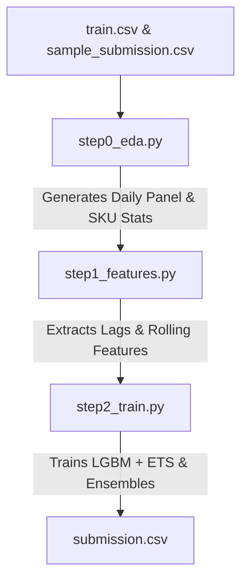

# HBAAC Retail Time-Series Forecasting Project

Welcome to the **HBAAC Time-Series Forecasting** project. This repository contains a production-ready machine learning pipeline to forecast daily transaction quantities for a retail system spanning **15,972 SKUs** across two 28-day forecasting horizons:
- **Validation Window**: Daily demand forecasting for days F1 to F28.
- **Evaluation Window**: Daily demand forecasting for days F29 to F56 (represented in the submission structure as days F1 to F28 in the `_evaluation` rows).

This pipeline has been optimized for local environment execution out-of-the-box, ensuring zero absolute-path dependencies and robust compatibility with modern libraries (including Pandas 3.x and NumPy 2.x support).

---

## 1. Environment Setup

To set up your local environment and install the correct dependencies, follow these steps:

```bash
# 1. Create a virtual environment (if not already done)
python -m venv venv

# 2. Activate the virtual environment
# On Windows (PowerShell):
.\venv\Scripts\Activate.ps1
# On Windows (CMD):
.\venv\Scripts\activate.bat
# On Linux/macOS:
source venv/bin/activate

# 3. Install dependencies (including PyArrow for Parquet support)
pip install -r requirements.txt
```

---

## 2. Working Mechanism of Codebase Files (Core Logic)

The system is logically divided into two major components: the **Core Pipeline** (training & forecasting) and **Post-Processing Utilities** (metric optimization).

### 2.1. Core Pipeline (`src/` Directory)



#### 📂 [step0_eda.py](file:///c:/Users/Admin/OneDrive%20-%20National%20Economics%20University/Desktop/HBAAC/src/step0_eda.py) — EDA & Data Foundation
* **Goal**: Read raw data, clean anomalies, and establish the data foundation structure for the entire pipeline.
* **How it works**:
  1. **Anomalies & Return Processing**: Identifies and processes returned transactions where `Quantity < 0` (negative quantity representing customer returns).
  2. **Daily Panel Grid Construction**: Maps all 1,754 calendar dates with 15,972 SKUs, building a complete temporal grid of 28,014,888 rows. Days with zero sales are filled with exactly `0.0`.
  3. **SKU Taxonomy & Profit Weights**: 
     * Computes the profit weight for each SKU based on its net sales (sales volume minus return volume).
     * Categorizes SKUs into four profit tiers (**A, B, C, D**) using Gini coefficient curves, and three demand density tiers (**Dense** for continuous sales, **Intermittent** for irregular sales, and **Sparse** for very low/rare sales).
  4. **Vietnamese Holiday Series Construction**: Ingests key national holidays (Tet Lunar New Year, solar New Year, National Day, etc.) to analyze temporal shifts before, during, and after holidays.
  5. **Naive Seasonal Baseline**: Computes baseline scores via 4-fold walk-forward cross-validation to establish the WRMSSE performance ceiling that machine learning models must beat.

#### 📂 [step1_features.py](file:///c:/Users/Admin/OneDrive%20-%20National%20Economics%20University/Desktop/HBAAC/src/step1_features.py) — Feature Engineering
* **Goal**: Extract and construct high-quality machine learning features from the historical time series for LightGBM models.
* **How it works**:
  * **Calendar Features**: Weekday, day of the month, month, quarter, year, and cyclical calendar encodings.
  * **Holiday Proximity Features**: Tracks proximity (number of days before and after) to major national holidays like Tet Lunar New Year, letting models learn stock-up behaviors before holidays and recovery periods after.
  * **Lags & Rolling Window Statistics**: Extracts historical demand values at specific offsets (Lag 7, 14, 21, 28) and rolling statistics (rolling mean, rolling standard deviation) across multiple windows (7, 14, 28, 56 days) to capture short-term trends and long-term seasonality.
  * **Parallel Execution**: Uses `joblib.Parallel` multi-processing to speed up feature computation across 28 million rows.

#### 📂 [step2_train.py](file:///c:/Users/Admin/OneDrive%20-%20National%20Economics%20University/Desktop/HBAAC/src/step2_train.py) & [step2_train-ablation-study.py](file:///c:/Users/Admin/OneDrive%20-%20National%20Economics%20University/Desktop/HBAAC/src/step2_train-ablation-study.py) — Training & Forecasting (Model Ensembling)
* **Goal**: Train machine learning models, perform Walk-Forward Cross-Validation, ensemble predictions, and generate final submissions.
* **How it works**:
  1. **Walk-Forward Cross-Validation**: Implements a robust 4-fold validation strategy mimicking the competition structure (each fold utilizes a 56-day validation window).
  2. **Hybrid Model Ensembling**:
     * **LightGBM Tweedie / Poisson (Tree Models)**: Excellent at handling *Intermittent* and *Sparse* SKUs because Tweedie/Poisson objectives handle heavily skewed, zero-inflated distributions perfectly.
     * **ETS (Holt-Winters Exponential Smoothing)**: A classic statistical forecasting model applied selectively to **Dense Tier-A** SKUs (high-profile, continuous demand products) to capture strong seasonal patterns that tree algorithms might struggle to model linearly.
  3. **Tier-Based Blending**: 
     * High-tier continuous SKUs blend LightGBM and ETS predictions.
     * Low-tier and sparse SKUs (Sparse Tier D) are routed to safe Naive forecasts to prevent model overfitting.

---

### 2.2. Post-Processing Utilities (`utils/` Directory)

After running Step 2 and generating the baseline prediction at `output/submission_outputs/submission.csv`, the following post-processing scripts are executed to maximize your submission score:

#### 📂 [apply_rule_zero_skus.py](file:///c:/Users/Admin/OneDrive%20-%20National%20Economics%20University/Desktop/HBAAC/utils/apply_rule_zero_skus.py) — Rule Zero (Deactivate Inactive SKUs)
* **How it works**:
  1. **Dual-Window History Analysis**: Analyzes active transaction history in `train.csv` for each SKU across two critical windows:
     * **Recent Window (last 30 days of train set)**: Checks if the product has had any transaction.
     * **Distant Window (days -90 to -30)**: Evaluates whether the product had very low/sporadic transaction volume beforehand.
  2. **Dead SKU Identification**: If a product has had little to no sales activity in both windows (or had only minor transaction counts offset by large return quantities), it is flagged as "discontinued" or "inactive".
  3. **Zeroing Forecasts**: Sets the prediction values for these flagged dead SKUs to exactly `0.0` for all future periods (F1 to F28). This deactivation eliminates WRMSSE error inflation caused by machine learning models predicting random sales noise for inactive products.

#### 📂 [apply_magic_mult.py](file:///c:/Users/Admin/OneDrive%20-%20National%20Economics%20University/Desktop/HBAAC/utils/apply_magic_mult.py) — Magic Multiplier
* **How it works**:
  1. Loads the rule-zeroed predictions (`submission_experiment_new.csv`).
  2. **Scales Active Predictions**: Multiplies all remaining non-zero forecasts by an optimal multiplier coefficient (e.g., `1.02` for main submission, or `1.03` for ablation study).
  3. **Safety Clipping**: Applies `.clip(lower=0.0)` and `.fillna(0.0)` to ensure multiplication never introduces negative values or NaNs.
  * *Scientific Rationale*: Due to standard RMSE loss functions tending to pull machine learning forecasts toward the mean (creating conservative predictions), multiplying active forecasts by a small constant factor (e.g. 1.02) helps match the skewed, right-tail nature of retail demand distributions and optimizes the score against the asymmetric loss properties of the WRMSSE metric.

---

## 3. Local Execution Guide

> [!IMPORTANT]
> **End-to-End Execution Automation**: Running either of the training/forecasting scripts (**`src/step2_train.py`** or **`src/step2_train-ablation-study.py`**) will automatically trigger the entire end-to-end pipeline—sequentially executing **Step 0 (EDA)**, **Step 1 (Feature Engineering)**, and then **Step 2 (Model Training & Ensembling)**. You do **NOT** need to run individual scripts beforehand if you want a full run.

### Scenario A: Running Exploratory Data Analysis (EDA) Only
To run the EDA data foundation stage, compile daily panels, and save the comprehensive visualizations to `output/eda_outputs/`:
```bash
$env:PYTHONUTF8=1; python src/step0_eda.py
```

### Scenario B: Running the Full End-to-End Pipeline
Simply run Step 2. The script will automatically trigger Step 0 (EDA) and Step 1 (Features) in the background:

* **Main Pipeline**:
  ```bash
  $env:PYTHONUTF8=1; python src/step2_train.py
  ```
* **Ablation Study Pipeline**:
  ```bash
  $env:PYTHONUTF8=1; python src/step2_train-ablation-study.py
  ```

### Scenario C: Running the Post-Processing Pipeline
After running Step 2 and getting `output/submission_outputs/submission.csv`, run the two post-processing steps:

```bash
# Step 1: Apply Rule Zero (Deactivate inactive/dead SKUs)
$env:PYTHONUTF8=1; python utils/apply_rule_zero_skus.py

# Step 2: Apply Magic Multiplier (Default 1.02)
$env:PYTHONUTF8=1; python utils/apply_magic_mult.py
```
*(The final optimized submission file will be saved as `submission_x1.02.csv` in the repository root).*
